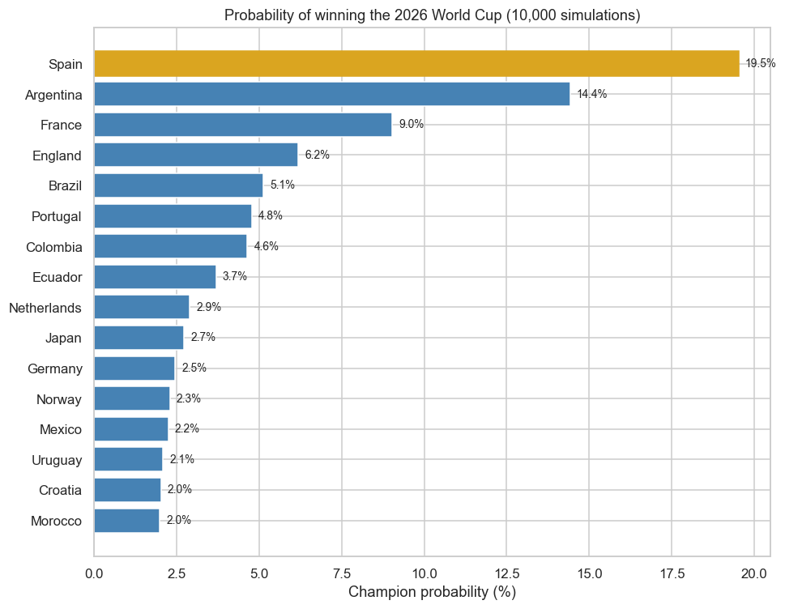
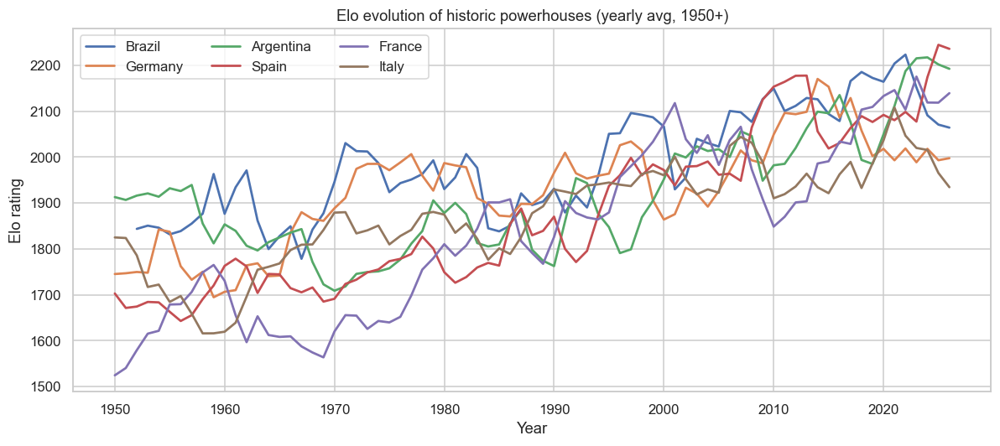
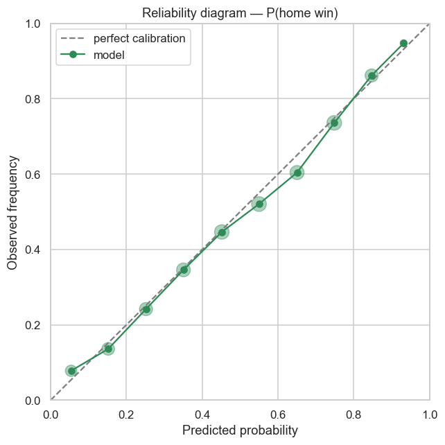

# 🏆 World Cup 2026 Predictor

> A reproducible, **explainable** machine-learning pipeline that estimates each national
> team's probability of winning the **2026 FIFA World Cup**, built from 150+ years of
> international match results and a 10,000-run Monte Carlo simulation of the official bracket.

*[Versión en español más abajo ↓](#-predictor-del-mundial-2026-español)*

  

---

## 🥇 Headline result

10,000 simulated tournaments → probability of lifting the trophy:



| # | Team | Champion | Reaches Final | Reaches Semifinal |
|---|------|---------:|--------------:|------------------:|
| 1 | 🇪🇸 Spain | **19.5%** | 29.8% | 43.0% |
| 2 | 🇦🇷 Argentina | 14.4% | 23.5% | 35.3% |
| 3 | 🇫🇷 France | 9.0% | 16.4% | 29.7% |
| 4 | 🏴 England | 6.2% | 12.5% | 23.2% |
| 5 | 🇧🇷 Brazil | 5.1% | 10.3% | 20.1% |

The favorite sits right in the band where the betting market and the historical record of
World Cup favorites live (~15-20%) — by **calibration against external benchmarks**, not by
eye. Each simulated tournament redraws every team's strength around its Elo rating
(σ=125, see [ADR-005](docs/decisions/ADR-005-rating-uncertainty.md)), modeling the fact that
ratings are estimates whose errors persist across a whole tournament. Football is
**low-signal, high-variance**, and the model embraces that uncertainty rather than faking
confidence.

## Why this project

The goal is **not** a crystal ball. It is to demonstrate a rigorous, end-to-end data-science
process that is **explainable**, **reproducible**, and **honest about uncertainty** — the kind
of work that holds up under scrutiny.

## How it works

```
results.csv (1872–2026)
        │  clean + normalize
        ▼
   Elo ratings  ──►  match features (elo_diff, form, rest, neutral)
        │                     │
        │                     ▼
        │            Logistic classifier  ── P(win/draw/loss), calibrated
        │                     ▲
        ▼                     │ cross-check (agree out-of-sample)
   Poisson goals model ───────┘
        │  scorelines
        ▼
   Monte Carlo × 10,000  (official FIFA 48-team bracket)
        ▼
   P(title) and P(reach each stage) per nation
```

**Two complementary models, cross-validated against each other:**
- A **calibrated logistic classifier** predicts match outcomes (used for evaluation & rigor).
- An **Elo-driven Poisson goals model** generates scorelines (used to drive the simulation,
  giving coherent goal difference for group tie-breaks).

The two are built independently yet agree on out-of-sample skill (log loss 0.8765 vs 0.8768),
strong evidence the pipeline is internally consistent.

### Key design decisions (with rationale)
| Decision | Choice | Why |
|---|---|---|
| Data | [`martj42/international_results`](https://github.com/martj42/international_results) | Free, no auth, reproducible |
| Team strength | Elo (an EWMA estimator) | Long-memory, leakage-safe, interpretable |
| Validation | **Temporal** split (train < 2022, test ≥ 2022) | No look-ahead bias |
| Model | Logistic regression **over** gradient boosting | Parsimony: ties/beats GBDT, simpler & calibrated |
| Scoring | Log loss, Brier, **RPS** | Proper scoring rules, not just accuracy |
| Bracket | **Official** FIFA 2026 structure | Credible, matches reality |
| Tournament realism | Per-tournament rating noise (σ=125) + data-fitted host advantage | Corrects correlated-error overconfidence; calibrated vs market & history |
| Consistency guard | Results sidecar (`simulation_results.meta.json`) | Dashboard verifies cached numbers match the live engine |

Full rationale lives in [`docs/decisions/`](docs/decisions/) as Architecture Decision Records.

## Results & analysis (notebooks)

| Notebook | What it shows |
|---|---|
| [`01_eda.ipynb`](notebooks/01_eda.ipynb) | Data exploration: goals, home advantage, coverage |
| [`02_features.ipynb`](notebooks/02_features.ipynb) | Elo engine + historic power evolution |
| [`03_modeling.ipynb`](notebooks/03_modeling.ipynb) | Benchmark, model selection, calibration |
| [`04_simulation.ipynb`](notebooks/04_simulation.ipynb) | Monte Carlo + title probabilities |
| [`05_robustness.ipynb`](notebooks/05_robustness.ipynb) | Sensitivity: training window & host advantage |

<p align="center">
  
  
</p>

*Left: Elo evolution of historic powers (peaks match real dynasties). Right: the classifier's
probabilities are well-calibrated — when it says 70%, it happens ~70% of the time.*

## Quickstart

```bash
python -m venv .venv
.venv\Scripts\activate              # Windows  (use: source .venv/bin/activate on macOS/Linux)
pip install -r requirements.txt

# Run the whole pipeline (download → clean → features → train → simulate):
python scripts/run_pipeline.py

# Or run the test suite:
pytest

# Or launch the interactive dashboard:
streamlit run streamlit_app.py
```

## 🖥️ Interactive dashboard

`streamlit run streamlit_app.py` opens a polished warm editorial dashboard (real team flags,
no clutter) with seven views:
- **Title race** — championship odds for all 48 teams, with a top-3 podium.
- **Bracket** — the fixed reference simulation: all 104 matches with exact scorelines, full
  group standings with every result, knockout tree and tournament stats. Its seed is chosen
  programmatically so its champion always matches the model's favourite.
- **Simulator** — deal brand-new tournaments from the same model, one click each, to *see*
  what a ~20% favourite really means.
- **Groups** — per-group advance probabilities.
- **Match predictor** — pick any two teams for win/draw/loss probabilities and an expected scoreline.
- **Validation** — the published evidence: out-of-time model benchmark, the reliability
  diagram, and the rating-uncertainty sweep tuned against market benchmarks.
- **How it works** — a plain-language, step-by-step methodology so the model explains itself.

### Deploying your own copy (free)

The repo is deploy-ready: the three artifacts the app needs (`matches_clean.csv` and the two
model files) are committed, so Streamlit Cloud can boot it directly.

1. Go to [share.streamlit.io](https://share.streamlit.io) and sign in with GitHub.
2. **Create app** → pick this repository, branch `main`, main file `streamlit_app.py`.
3. Deploy. You get a public, shareable URL like `https://<your-app>.streamlit.app`.

## Project structure

```
.
├── data/                # raw (downloaded), processed (regenerated), external (WC2026 fixture)
├── src/
│   ├── data/            # download + cleaning
│   ├── features/        # Elo + feature engineering
│   ├── models/          # classifier + Poisson goals model
│   └── simulation/      # bracket, match engine, tournament, Monte Carlo
├── notebooks/           # narrative analysis (01 → 04)
├── tests/               # pytest suite (invariants)
├── docs/decisions/      # Architecture Decision Records
├── reports/figures/     # generated visualizations
└── scripts/run_pipeline.py
```

## Validation & rigor
- **No leakage:** every feature is pre-match; the train/test split is strictly chronological.
- **Proper scoring rules:** evaluated with log loss, multiclass Brier, and RPS — not accuracy alone.
- **Calibration:** verified with a reliability diagram.
- **Internal consistency:** the independent classifier and Poisson models agree out-of-sample.
- **Tests:** 14 passing invariants (Elo zero-sum, distribution sums, one-champion-per-tournament, …).

## Honest limitations
- Team-level only — no squad/injury/player data.
- Hosts modeled on neutral ground (no home-crowd boost) — a documented refinement.
- Independent Poisson slightly under-models draws (Dixon-Coles is the planned v2 fix).
- Deep group tie-breaks resolved by lot, as in the real rules.

## Roadmap
- [x] Data pipeline, EDA, Elo, classifier, Poisson model, Monte Carlo, official bracket, tests
- [x] Interactive Streamlit dashboard (`streamlit_app.py`)
- [ ] *(v2)* Dixon-Coles draw correction & host-nation advantage
- [ ] *(v2)* Compare model odds vs bookmaker-implied probabilities + Kelly staking (quant capstone)

---

## 🏆 Predictor del Mundial 2026 (Español)

Pipeline de *machine learning* **reproducible y explicable** que estima la probabilidad de
que cada selección gane el **Mundial 2026**, a partir de 150+ años de resultados y una
simulación **Monte Carlo de 10.000 torneos** sobre el cuadro oficial.

**Resultado principal:** 🇪🇸 España **19.5%** · 🇦🇷 Argentina 14.4% · 🇫🇷 Francia 9.0% ·
🏴 Inglaterra 6.2% · 🇧🇷 Brasil 5.1%. El favorito queda en la banda del mercado de apuestas y
del registro histórico (~15-20%), calibrado contra benchmarks externos y no "al ojo",
reflejando con honestidad la alta varianza del fútbol.

**Cómo funciona:** se calcula un **Elo** (fuerza histórica) de cada selección → alimenta un
**clasificador logístico calibrado** (victoria/empate/derrota) y un **modelo de goles de
Poisson** que genera marcadores → se simula el torneo 10.000 veces con el **cuadro oficial de
FIFA** → se leen las probabilidades de campeón y de llegar a cada fase.

**El punto clave:** el objetivo no es adivinar al campeón, sino demostrar un proceso de ciencia
de datos **riguroso, explicable y reproducible**, honesto sobre la incertidumbre. Las decisiones
de diseño están documentadas en [`docs/decisions/`](docs/decisions/).

**Cómo correrlo:**
```bash
python -m venv .venv && .venv\Scripts\activate
pip install -r requirements.txt
python scripts/run_pipeline.py
```

---

*Built as a portfolio project demonstrating applied ML, data engineering, statistics, and
reproducible research practices. Co-developed with AI pair programmers (Claude Code / Gemini CLI)
under a documented collaboration protocol — see [`PROJECT_STATUS.md`](PROJECT_STATUS.md).*
